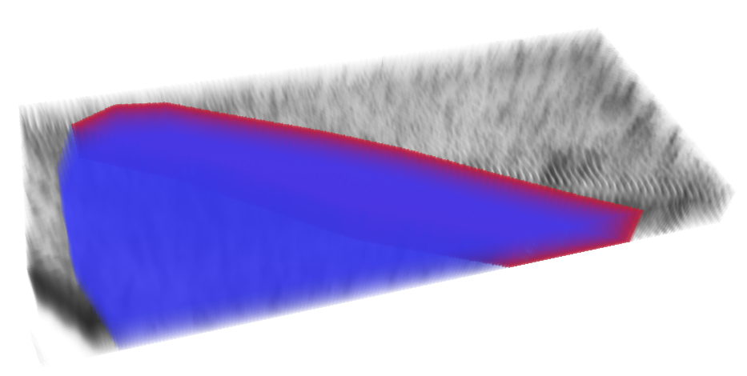

# Sod1_CuATSM_Image_Analysis

The image analysis workflow has 5 main parts:
1) Hand annotate the region of interest and a sub region of interest containing the neurons
2) Identify a threshold range to capture SOD1 protein aggregates  
3) Create a deep learning model (retraining cellpose) to segment neurons (insert notebook name)
4) Run a batch process to analyze all the images (insert notebook name)
5) Collate all the CSVs created in step 4 (insert notebook name)

Briefly, here is an example of each step. 

## Hand annotate the region of interest and a sub region of interest containing the neurons

Raw slide scanner z-stack immunofluorescence images (.vsi files) of slides stained with SOD1, TH, GFAP and Hoechst were prepared for downstream analysis by first cropping and exporting a large substantia nigral (SN) region of interest (ROI) using QuPath (v.0.5.1) as an ome.tiff with no compression. These exported ome files were loaded into a FIJI macro script (see github files 1) which allowed for consistent file preparation. The script involves multiple prompts requiring inputs at each stage of image preparation. From this script, the second series of the ome files (resolution 2200x1889) were saved as tiff files for which the brightness and contrast of all images were set to a defined grayscale intensity 115-700 to ensure uniform SOD1 thresholding between mice and z-slices where all channels were in focus were noted for downstream quantitative analysis.

Using the FIJI script, the two specific SN regions of interest were manually outlined using the polygon tool (prompted by the script) and converted to a binary-filled mask area to be added to analysis. The two regions being the smaller SN pars compacta (SNc) region (an example shown in red below) and the larger SNc + SN pars reticulata (SNr) region (an example shown in blue below). 

 

## Identify a threshold range to capture SOD1 protein aggregates 

Following ROI selection in the FIJI script, the SOD1 channel intensity was manually thresholded  in FIJI to predetermined/arbitrary signal-to-noise values while the background pixels were reduced to no value. This accounted for variable illumination and image intensities between all images 

## Create a deep learning model (retraining cellpose) to segment neurons

A custom trained deep learning artificial intelligence (AI) cellpose model called “cellpose-residual_on_styple_on_concatenation_off_train_folder_2024_04_11_16_19_30.312228”  (see github files 2) was trained for use in downstream neuron stereological analysis. This cellpose model was trained on 50 2-dimensional image slices from 16 z-stack images (from 8 different mice; 10% of cohort) which had been manually segmented by one investigator. It was then applied to an additional set of 8 slices in which neurons had also been manually segmented and counted, resulting stereological counts exhibited an accuracy of 0.72 and f1 score of 0.83. These performance results are similar to previous studies utilising AI tissue-based cell segmentation for images with an increased signal-to-noise ratio (Ghoddousi, 2022; Han, 2023 ). 

 

###### Example 2-dimensional raw image slices from z-stack.

 

###### Example 2-dimensional raw image slices from z-stack with corresponding mask to (re)train cellpose. 

The code to train the model is in the script "sod1_cellpose.ipynb" the key paramaters used were:
| Input  | Value |
| ------------- | ------------- |
| number_of_epochs | 500  |
| initial_learning_rate  | 0.1  |
| batch_size | 16  |
| percentage_validation  | 20  |
| Use_Data_augmentation  | False  |
| Pretrained_model | "Cytoplasm2"  |

The code we used was essentially the [ZeroCostDL4Mic](https://www.nature.com/articles/s41467-021-22518-0/) cellpose notebook, however we created a local conda environment as to not be limited by colab sessions running out of resources.

## Run a batch process to analyze all the images

To analyse the images with neuron stereology, astrocyte segmentation and SOD1 localisation quantification, an automated custom python workflow (SOD_1_image_analysis_loop.ipynb) was used to process the tiff images produced during the pre-processing stage. The workflow generated a spatial profile within the inputted SN ROIs for the neurons, astrocytes and SOD1 and forms a three-dimensional (3D) reconstruction allowing visualisation of the spatial localisation of SOD1 aggregates within and outside these cell types.

The workflow is based of a "ref_master_csv, with the following structure:

| Directonary                                            | IMAGE_ID                      | min_thresh | max_thresh | first_slice | last_slice | Genptype | Treatment | Width (Pixels) | With (um) | Height (Pixels) | Height (um) | C dim | Z dim | T dim | X_pix | Y_pix | Z_pix |
|--------------------------------------------------------|-------------------------------|------------|------------|-------------|------------|----------|-----------|----------------|-----------|-----------------|-------------|-------|-------|-------|-------|-------|-------|
| R:\PRJ-SOD1_AI\cuatsm_treatment_sod_1_analysis_200_300 | MS167_SN_Z01_1_VC_Tiff_format | 370        | 698        | 2           | 35         | SOCK     | SSV       | 12246          | 1408.29   | 10890           | 1252.3      | 4     | 41    | 1     | 0.115 | 0.115 | 0.5   |
| R:\PRJ-SOD1_AI\cuatsm_treatment_sod_1_analysis_200_300 | MS167_SN_Z01_2_VC_Tiff_format | 374        | 698        | 3           | 36         | SOCK     | SSV       | 12246          | 1408.29   | 10890           | 1252.3      | 4     | 41    | 1     | 0.115 | 0.115 | 0.5   |
| R:\PRJ-SOD1_AI\cuatsm_treatment_sod_1_analysis_200_300 | MS167_SN_Z03_1_VC_Tiff_format | 381        | 698        | 1           | 39         | SOCK     | SSV       | 17910          | 2059.66   | 12480           | 1435.2      | 4     | 41    | 1     | 0.115 | 0.115 | 0.5   |
| R:\PRJ-SOD1_AI\cuatsm_treatment_sod_1_analysis_200_300 | MS167_SN_Z03_2_VC_Tiff_format | 377        | 698        | 1           | 36         | SOCK     | SSV       | 17910          | 2059.66   | 12480           | 1435.2      | 4     | 41    | 1     | 0.115 | 0.115 | 0.5   |
| R:\PRJ-SOD1_AI\cuatsm_treatment_sod_1_analysis_200_300 | MS167_SN_Z05_1_VC_Tiff_format | 367        | 698        | 1           | 33         | SOCK     | SSV       | 16272          | 1871.29   | 10584           | 1217.16     | 4     | 41    | 1     | 0.115 | 0.115 | 0.5   |
| R:\PRJ-SOD1_AI\cuatsm_treatment_sod_1_analysis_200_300 | MS167_SN_Z05_2_VC_Tiff_format | 381        | 698        | 1           | 38         | SOCK     | SSV       | 16272          | 1871.29   | 10584           | 1217.16     | 4     | 41    | 1     | 0.115 | 0.115 | 0.5   |
| R:\PRJ-SOD1_AI\cuatsm_treatment_sod_1_analysis_200_300 | MS167_SN_Z07_1_VC_Tiff_format | 377        | 698        | 1           | 35         | SOCK     | SSV       | 13200          | 1518      | 13272           | 1526.28     | 4     | 41    | 1     | 0.115 | 0.115 | 0.5   |

The explanation for each column is as follows:

| Column Title  | Explanation |
| ------------- | ------------- |
| Directonary | The location of the image  |
| IMAGE_ID  | A unique ID for each image  |
| min_thresh | min grayscale range for indetifying SOD1  |
| max_thresh  | max grayscale range for indetifying SOD1  |
| first_slice  | crops the image  |
| last_slice | crops the image   |
| Genptype  | identifies the genotype  |
| Width (Pixels) | image width in pixels   |
|  With (um)  | image width in micron   |
| Height (Pixels) |  image height in pixels   |
| Height (um) |  image height in micron   |
|  C dim | number of channels  |
| Z dim | number of Z slices   |
| T dim | number of time channels   |
|  X_pix| X pixel size (um)  |
|  Y_pix | Y pixel size (um)   |
|  Z_pix | Z pixel size (um)   |

For each IMAGE_ID there are 3 files 
#### 1)	IMAGE_ID + “Tiff_format “
- This contains the 4 channel ome.tiff 
#### 2) IMAGE_ID + “mask “
- This contains the SNc + SN pars reticulata (SNr) 3D mask
#### 3) IMAGE_ID + “neuron_outline “
- This contains the SN pars compacta (SNc) region 3D mask

For neuron stereology, the python workflow ran the relevent channel through the custom trained cellpose model in order to locate and segment every neuron in the SNc ROI. It is important to note our model was trained on 2D data to produce 3D segmentations of neurons. This is done using “stitching” as described in the cellpose documentation 

*Cellpose will create ROIs in 2D on each XY slice and then stitch them across slices if the IoU between the mask on the current slice and the next slice is greater than or equal to the stitch_threshold* 

after some trial and error we settled on a stitch_threshold of 0.25. The 3D images was then binarized and cleaned using a dilation, fill holes, erosion and remove small objects sequence. 
Then produced neuron counts/stereology and 3D reconstructions of their spatial location in the image. Neuronal density was calculated as the number of SNc dopamine neurons divided by the volume of the SNc.

To capture the non-uniform morphology of an astrocyte, the python workflow applied qsegmentation method of triangular yen thresholding, a size filter removed small objects. The workflow segmented astrocytes to measure and record their volume in the SNc and SNr and created a 3D-reconstruction of their spatial location in the image.

For SOD1 quantification, the python workflow applied the SOD1 manual thresholds. The Python workflow subsequently reports 3D measurements of both cellular (inside neurons and astrocytes) and other SOD1 aggregate volumes within the SNc and SNr regions (as defined by the masks from FIJI). The generation of a spatial profile and quantification of the thresholded SOD1 channel produced a 3D reconstruction allowing visualisation of the spatial localisation of SOD1 aggregates within and outside the different cell types.

